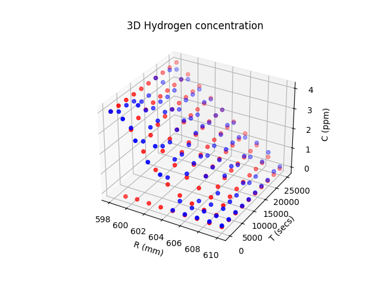
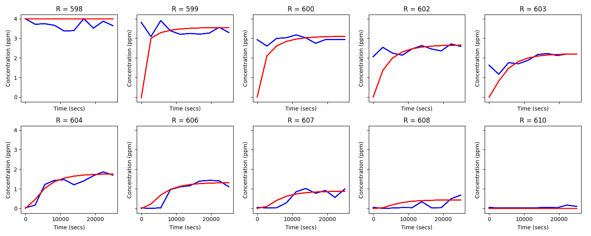
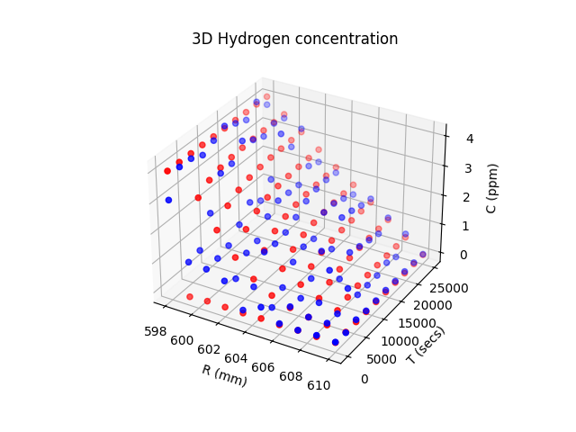
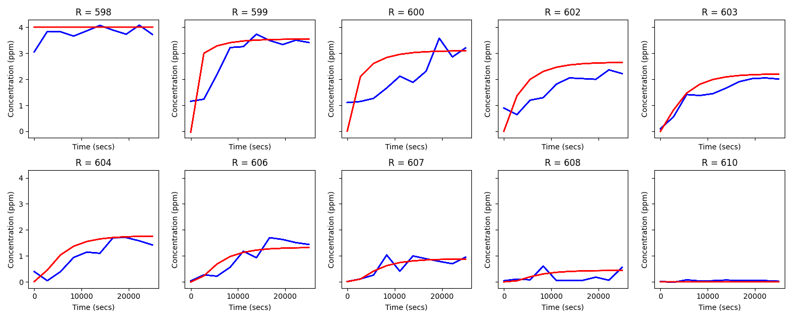

# PINN-Hydrogen-Diffusion
Modeling of Hydrogen Diffusion in a pipe using PINN

Disclaimer: there are better results, which are published here https://www.springerprofessional.de/application-of-physics-informed-neural-networks-for-modeling-hyd/51878826
I'm just to lazy to update the repo :3

### Notes:
Blue - model prediction  
Red - analytical solution 

### Hydrogen distribution using only data

### Hydrogen distribution using data, boundary and physics

